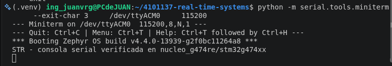

# EV-W01-SERIAL-004 — Modified serial-console message

## Identification

| Field | Value |
|---|---|
| Date | 2026-09-21 |
| Operator | `ing_juanvrg` |
| Objective | Verify the edit-build-flash-monitor cycle over the board serial console |
| Platform | NUCLEO-G474RE (`nucleo_g474re/stm32g474xx`) |
| Application | Modified Zephyr `samples/hello_world` |
| Verdict | PASS |

## Reproduction

The application message was changed to:

```c
printf("STR - consola serial verificada en %s\n", CONFIG_BOARD_TARGET);
```

The existing physical-board build was rebuilt and programmed with pyOCD. The
serial monitor was then opened at the configuration required by the guide:

```bash
west build -d build/hello_world-nucleo-g474re
west flash -d build/hello_world-nucleo-g474re --runner pyocd
python -m serial.tools.miniterm /dev/ttyACM0 115200
```

## Observed result

```text
--- Miniterm on /dev/ttyACM0  115200,8,N,1 ---
*** Booting Zephyr OS build v4.4.0-13939-g2f0bc11264a8 ***
STR - consola serial verificada en nucleo_g474re/stm32g474xx
```

### Screenshot



The STLINK-V3 serial interface was enumerated as `/dev/ttyACM0`, accessible to
the student through the `dialout` group.

## Interpretation

The modified text proves that the source change was compiled into a new image,
programmed into the MCU, executed after reset, and transported through the
configured serial-console path at 115200 baud, 8 data bits, no parity, and one
stop bit. The functional check passes, and the monitor screenshot requested by
`labs/lab01_bringup.md` is stored alongside this record.
